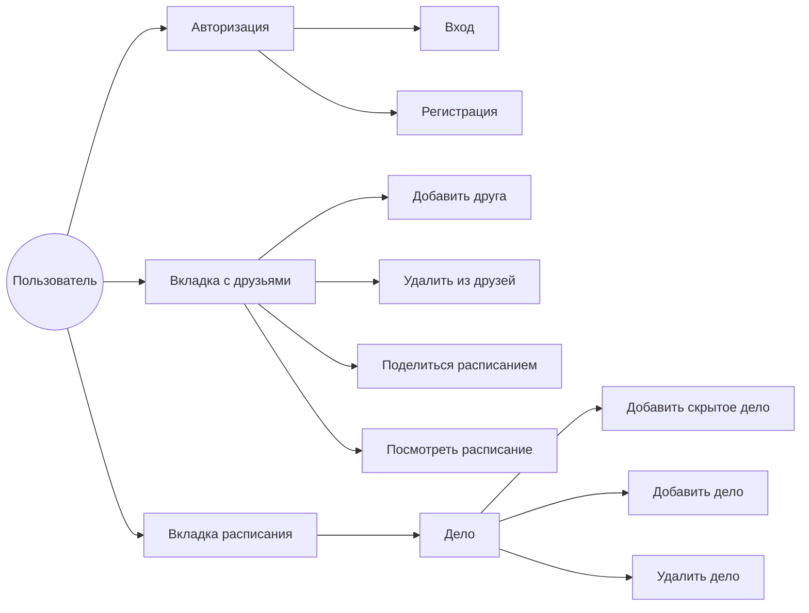

# Диаграмма UseCase

```mermaid
graph LR
    U((Пользователь)) --> Auth[Авторизация]
    Auth[Авторизация] --> Login[Вход]
    Auth --> Register[Регистрация]
    U --> F[Вкладка с друзьями]
    F --> Add_F[Добавить друга]
    F --> Remove_F[Удалить из друзей]
    F --> Share_F[Поделиться расписанием]
    F --> Look_F[Посмотреть расписание]
    U --> Schedule[Вкладка расписания]
    Schedule --> Task[Дело]
    Task --> Add_private_Sch[Добавить скрытое дело]
    Task --> Add_Task[Добавить дело]
    Task --> Delete_Task[Удалить дело]
    
```