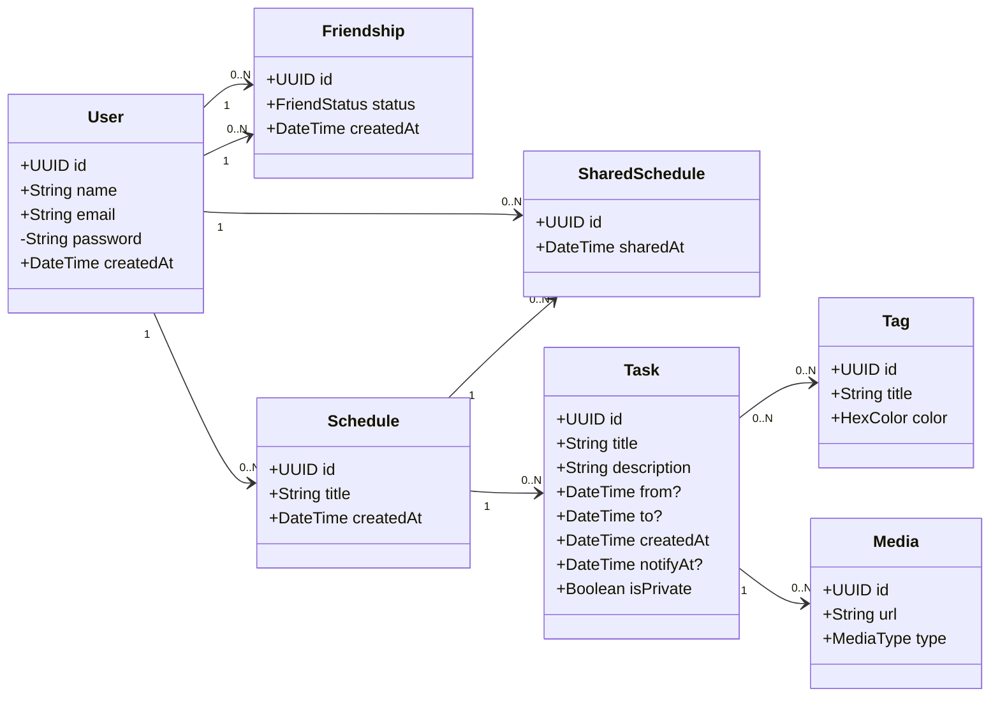

# Диаграмма классов

```mermaid
classDiagram
    direction LR

    class User {
        +UUID id
        +String name
        +String email
        -String password
        +DateTime createdAt
    }

    class Friendship {
        +UUID id
        +FriendStatus status
        +DateTime createdAt
    }

    class Schedule {
        +UUID id
        +String title
        +DateTime createdAt
    }

    class SharedSchedule {
        +UUID id
        +DateTime sharedAt
    }

    class Task {
        +UUID id
        +String title
        +String description
        +DateTime from?
        +DateTime to?
        +DateTime createdAt
        +DateTime notifyAt?
        +Boolean isPrivate
    }

    class Tag {
        +UUID id
        +String title
        +HexColor color
    }

    class Media {
        +UUID id
        +String url
        +MediaType type
    }

    User "1" --> "0..N" Friendship
    User "1" --> "0..N" Friendship

    User "1" --> "0..N" Schedule

    Schedule "1" --> "0..N" SharedSchedule
    User "1" --> "0..N" SharedSchedule

    Schedule "1" --> "0..N" Task
    Task "0..N" --> "0..N" Tag
    Task "1" --> "0..N" Media

```
